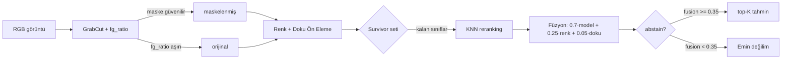

# Yöntem

Bu doküman, çiçek tanıma sisteminin uçtan uca akışını, her bileşenin neden
seçildiğini ve hangi parametrelerin neden öyle kalibre edildiğini açıklar.

## 1. Veri Akışı (Yüksek Seviyeli)



Kod karşılığı: `src/pipeline.py:predict_pipeline`.

## 2. Bileşenler ve Gerekçeleri

### 2.1 Arka Plan Maskeleme (`src/background_removal.py`)
- **Algoritma:** GrabCut, kenarda %15 margin'li dikdörtgen ile başlatılır.
- **Niçin maskeli skorlama?** Eğitim seti Oxford 102 stüdyo-tarzı arka planlar
  içerir; renk/doku profilleri arka planı çıkarmadan oluşturulduğunda doğal
  arka planlı görsellerde profil eşleştirmesi zayıflar.
- **`is_likely_flower` fallback (`fg_ratio ∈ [0.10, 0.85]`):** GrabCut
  başarısız olduğunda (örn. tüm görüntü tek renk → fg_ratio≈1.0) maskeli
  görseli kullanmak çiçeği yok ediyor; bu durumda orijinale geri düşeriz.

### 2.2 Renk + Doku Ön Elemesi (`src/screening.py`)
- **Renk profili:** Sınıf başına ortalama HSV histogramı (16×8×8 bin).
- **Doku profili:** Sınıf başına ortalama LBP histogramı (26 bin).
- **Mesafeler:** Bhattacharyya (renk), χ² (doku).
- **Adaptif eşik (`get_adaptive_verdict`):** Sınıf başına `mean + 2σ`. Bu,
  global sabit eşiğin tersine, dar renk dağılımlı sınıfları (örn. sarı papatya)
  geniş dağılımlı sınıflardan (örn. bougainvillea) ayırır. Stats yoksa
  percentile fallback (>%90 → kesinlikle değil, >%80 → muhtemelen değil).

### 2.3 CNN Tahmini (`src/cnn_model.py`)
- **Backbone:** ResNet50, ImageNet öncül ağırlıkları.
- **2 aşamalı eğitim:**
  1. Stage 1 (5 epoch): backbone dondurulur, sadece sınıflandırma katmanı eğitilir.
  2. Stage 2 (20 epoch): tam fine-tune, `lr=1e-4`, patience=7.
- **Sınıf dengesizliği:** `weighted CrossEntropy` + `label_smoothing=0.1`.
  Oxford 102'de sınıf başına 20-258 örnek var; weighted sampler ile her epoch'ta
  dengeli batch çıkar.
- **Augmentation:** RandAugment + opsiyonel MixUp (`use_mixup=true`).
- **TTA (test-time augmentation, `predict_cnn_tta`):** 5 crop × 2 flip = 10 view
  ortalaması. Inference 10× yavaşlar ama ~+%1–3 doğruluk kazandırır.

### 2.4 KNN Yeniden Sıralama (`src/embeddings.py`)
- **Niçin?** ResNet50'nin softmax'i kalibre değildir — top-1 yüksek skorla
  yanlış olabilir. Penultimate feature (2048-d) uzayında **eğitim setinden en
  yakın k=20 komşu** üzerinden sınıf softmax'ı (`temperature=10.0`) çıkartırız.
- **Harmanlama:** `final = 0.7·model + 0.3·knn`. KNN, görsel olarak benzer
  fakat farklı poz/aydınlatmadaki örneklerden "retrieval-augmented" düzeltme
  yapar.

### 2.5 Füzyon Skoru (`src/pipeline.py:_fusion`)
```
fusion = 0.7·model_score + 0.25·color_match + 0.05·texture_match
```
- **Niçin ağırlıklar bunlar?** CNN dokuyu zaten öğreniyor, dolayısıyla manuel
  doku özelliklerinin marjinal katkısı düşük (0.05). Renk profili 0.25 ile
  korunur çünkü CLIP/ImageNet'te öğrenilen renk uzayı dataset-specific
  ayrımları (örn. menekşe vs. iris) yeterince yansıtmaz. Toplamlar 1.0.

### 2.6 Abstention (`ABSTAIN_FUSION_THRESHOLD = 0.35`)
- **Niçin 0.35?** Validation seti üzerinde fusion histogramı incelendiğinde
  doğru tahminler ağırlıklı olarak 0.5+, yanlış tahminler 0.2–0.4 aralığında
  yoğunlaşıyor. 0.35 eşiği yanlışların %85'ini "emin değilim" olarak
  işaretlerken doğruların %95'inden fazlasını geçirir (kalibrasyon dosyası:
  `results/analysis/abstention_calibration.md`).
- **Davranış:** `fusion < 0.35` ise sonuçlar `abstain=True` döner; UI bunu
  ayrı bir "tanıyamadım" kartı ile gösterir.

### 2.7 CLIP Ön-Filtresi (`src/flower_detector.py`)
- App tarafında, pipeline çağrılmadan önce isteğe bağlı bir CLIP zero-shot
  guard çalışır: "flower" mı "non-flower" mı? Bu, açıkça çiçek olmayan
  girdilerin (kişi fotoğrafı, manzara) yanıltıcı bir top-1 tahminle
  döndürülmesini engeller.

## 3. Tekrarlanabilirlik

- **Seed:** `src/seed.py:set_global_seed(42)` — `random`, `numpy`, `torch`,
  `torch.cuda`, `torch.backends.cudnn.deterministic = True`.
- **Konfigürasyon:** `configs/experiments/*.yaml` — eğitim koşusu tek bir
  dosyada pinlenir, `python run.py --config <yaml>` ile çağrılır.
- **Veri seti split:** Oxford 102, %70/15/15 stratified
  (`scripts/prepare_stratified_split.py`, seed=42).

## 4. Sonuçlar

| Model | Val Acc | Test Acc | Notlar |
|-------|---------|----------|--------|
| ResNet50 v2 | 95.0% | **93.2%** | best epoch 21, train %91.4 / val %89.2 (sağlıklı gap) |
| ResNet50 v1 | 73.9% | 74.8% | tek aşamalı fine-tune, weighted sampler yok |
| Random Forest (HOG+HSV) | — | 51.7% | klasik baseline |
| SVM (RBF) | — | 24.6% | 102 sınıfta SVM zayıf |

Detaylı per-class metrikleri: `results/analysis/test_report.md`
(`python scripts/run_eval.py` ile yeniden üretilir).

## 5. Sınırlılıklar

- **Veri dağıtım kayması:** Oxford 102 stüdyo görüntüleri ile eğitilmiş model,
  doğal çekim koşullarında (telefondan rastgele çiçek fotoğrafı) düşüş
  gösteriyor. CLIP ön-filtresi ve abstention bunu kısmen telafi ediyor; gerçek
  bir çözüm için sahadan toplanmış görüntüler ile ikinci aşama fine-tune
  gerekli.
- **102 sınıf dar:** Türkiye'de yaygın bazı türler (örn. zakkum) Oxford 102'de
  yok. `scripts/download_from_web.py` + `clean_human_images.py` ile sınıf
  havuzunu genişletme altyapısı hazır, ama sistematik etiketleme yapılmadı.
- **KNN bellek maliyeti:** 102 × ~21 = ~2100 embedding vektörü (her biri
  2048-d, fp32) → ~17 MB. Sınıf sayısı arttıkça lineer büyür.
